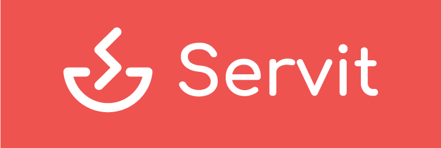
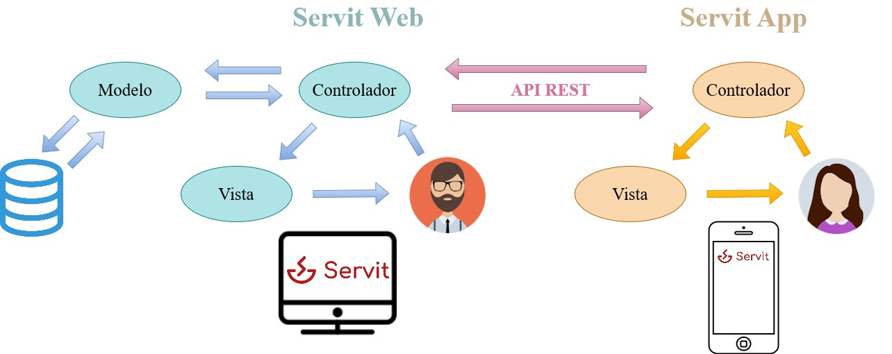

# Servit

¡Hola! Bienvenido al repositorio de Servit. Aquí podrás observar la evolución de la implementación del proyecto en sus diferentes versiones. Además, también te explicamos a continuación de forma resumida cómo ha sido el proceso de diseño de Servit.

Trabajo de Fin de Grado. Universidad de Granada.

Autor:

* :bust_in_silhouette: Fernando Izquierdo Romera

## ¿Qué pretende Servit?

  

Servit es un proyecto software orientado a la gestión interna de los restaurantes como puede ser el catálogo, los recursos humanos o la distribución de espacios pero que tiene como objetivos peculiares:

* La involucración del cliente en el sistema, de forma que la interacción no sea cliente-camarero sino que el cliente pueda realizar sus propios pedidos desde su dispositivo y que cuando termine pueda valorar su experiencia.
* Proporcionar informes a los propietarios de los restaurantes sobre el rendimiento del mismo, no solo relacionados con aspectos económicos sino también con las valoraciones que hayan llevado a cabo los usuarios.
* Poner a disposición de los camareros una herramienta que facilite su trabajo y que permita al propietario repartir la tareas de atención al cliente entre sus empleados.

# Proceso de diseño

## Metodología de desarrollo: Design Thinking y el Diseño Centrado en el Usuario

El Pensamiento de Diseño es un enfoque de innovación, centrado en el ser humano (por eso está muy relacionado con el Diseño Centrado en el Usuario) que se basa en el conjunto de herramientas de diseño que integran las necesidades de las personas, las posibilidades de la tecnología y el éxito de negocio.

Por eso nuestro principal objetivo será intentar comprender a nuestros posibles usuarios (ponernos en su piel) y ver cuáles son las necesidades qué tienen o qué es lo que se esperan de nuestras aplicaciones para producir la mejor experiencia de usuario posible (UX) e introducirlas en nuestra idea de negocio ya establecida.

Las herramientas que utilizaremos serán: las personas ficticias, la malla receptora de información (*feedback capture grid*), las matrices de tareas de usuarios (con su correspondiente *sitemap* y *labelling*) y finalmente el bocetaje.

## Análisis de la competencia

Antes de comenzar con el desarrollo de nuestro proyecto, es muy importante llevar a cabo un estudio de mercado para saber qué ofrece la competencia y hacer que si el usuario tuviera que elegir entre varias opciones, se decante por Servit. A continuación mostramos una tabla resumen con las principales características analizadas de la competencia.

  

## 1. Fase de empatía: Personas ficticias

Disponemos de tres personas ficticias cada una en representación de grupos de usuario con diferentes niveles de experiencia en las tecnologías (experimentados, inexpertos e intermedios), de forma que intentaremos que la usabilidad y la experiencia de usuario de nuestro software sea óptima, independientemente del nivel tecnológico del usuario.

Las personas ficticias vienen acompañadas de una experiencia de la persona en una de las aplicaciones que hemos analizado anteriormente, de forma que podemos coger ideas para nuestro proyecto.

### Usuarios experimentados

  

* Experiencia: *Lucas está trabajando de camarero en verano para ahorrar un poco de dinero y poder irse de viaje. El restaurante donde está trabajando usa como software de gestión XDREST. Su experiencia con este software no está siendo muy buena y le está costando acostumbrarse. Siente que el menú principal tiene demasiada información en la pantalla. Además cada vez que va a tomar un pedido en la TPV, normalmente se encuentra a un compañero que ya la está utilizando y tiene que esperarse unos segundos puesto que solo lo puede utilizar una persona a la vez.*

### Usuarios inexpertos

  

* Experiencia: *Carlos posee un restaurante y para mejorarlo decidió contratar el software de Hosteltáctil. Aunque no se maneja muy bien con la tecnología, ha conseguido amoldarse bien a su nuevo software, gracias a los manuales y tutoriales que proporciona la empresa. 
  	Carlos ha sentido una notable mejoría en la organización tanto de los pedidos como de la preparación de los pedidos en cocina por los diferentes módulos que le proporciona Hosteltáctil. También los pedidos se toman más rápido gracias a que cada camarero cuenta con un dispositivo. Otro aspecto que le ha gustado es que cuando llega a casa, puede repasar tranquilamente la actividad que ha habido en el restaurante y como van los ingresos.
  	Un día mientras Carlos estaba en su casa repasando la caja del día anterior, se le ocurrió una combinación de menú y un nuevo plato que le gustaría incorporar en la carta de su restaurante. Pensó que se podría cambiar desde la web (a él le parecía lógico) pues Hosteltáctil le informó que los datos se guardaban en la nube, pero no encontró ningún apartado para poder modificar la carta. Tuvo que esperar al siguiente día y poder hacerlo en la TPV del restaurante.*

### Usuarios intermedios

  

* Experiencia: *Marta y su pareja Andrea salieron a cenar y decidieron entrar en un restaurante. Este restaurante contaba con el software de EntreCartas. Cuando el camarero les trae las tablets para que elijan su pedido, Marta se sorprende gratamente y tiene curiosidad por ver cómo se muestra la carta. Siente que está en un restaurante “moderno” y de calidad.
  	Le parece muy cómodo que puede observar toda la carta, no tiene la presión del camarero para tener que elegir y no lo necesita para preguntarle en qué consiste cada plato, pues lo explica la aplicación. Además, Marta es alérgica a algunos alimentos y con esta carta puede saber qué platos puede comer y cuáles no. La valoración de Marta en la aplicación es muy positiva.*

## 2. Ideación: *Feedback Capture Greed*

La malla receptora de información es una técnica que incluye *brainstorming* para generar nuevas ideas, pero también intenta recoger las experiencias de nuestras personas ficticias descritas anteriormente.

  

## 3. Definición de la propuesta

 Establecemos una solución que se se divide en dos módulos: una página web y una aplicación.

### 3.1 Página web

La página web permite gestionar todo lo que esté relacionado con el restaurante que será accedida por los propietarios de los mismos y que deberán registrarse o iniciar sesión en su defecto. La administración del restaurante se dividirá en diferentes secciones: carta, mesas, empleados, información general, finalmente informes, históricos. Dentro de estas secciones, contaremos con tablas que organicen la información y formularios para registrar nuevos elementos o editarlos. A continuación se explica brevemente en qué consistirá cada sección:

* **Carta**: aquí el usuario podrá gestionar sus productos, organizarlos en categorías y crear menús.
* **Empleados:** el usuario podrá introducir los datos de cada empleado, así como asignarles un usuario y una contraseña para que puedan iniciar sesión en la aplicación.
* **Mesas:** el usuario dará de alta las mesas que requiera y podrá asignarles un empleado.
* **Información general:** en esta sección se podrá cambiar la información del restaurante que aparecerá en la parte pública de la aplicación (dirección, horario..).
* **Informes:** cómo está siendo la experiencia de los clientes en las mesas.
* **Históricos:** qué pedidos se hicieron, en qué mesas, quién lo atendió..

La página web también contará con una parte pública donde se podrán consultar los restaurantes que están registrados en la plataforma, así como su información de interés.

### 3.2 Aplicación

La aplicación está orientada para los clientes y los empleados de los restaurantes. El inicio de sesión discriminará entre usuarios que son clientes y los que son empleados, pues los empleados habrán sido dados de alta por el propietario previamente. Dentro de los empleados, también se distinguirá entre cocineros y camareros, debido a que tienen vistas diferentes. 

En la parte de los clientes, la aplicación contará con una sección similar a la parte pública de la página web donde podamos ver los restaurantes registrados. Podremos acceder a un restaurante concreto mediante la inserción de un código relacionado con la mesa y una vez introducido podremos navegar por la carta, hacer pedidos, pedir la cuenta, o reclamar la atención presencial del camarero. Finalmente, el usuario podrá hacer una valoración que después será utilizada para formular los informes.

En la parte de los empleados, tendrán una vista con una lista de mesas que les corresponde atender. Dentro de cada mesa podrán saber si tienen comandas pendientes para llevar o indicar que ya los ha llevado, si han pedido la cuenta o si requieren su atención. Cada empleado puede contar con un dispositivo, obteniendo así el mayor grado de distribución de trabajo posible.

En el caso de que el empleado tenga rol de cocinero, dispondrá de una vista diferente donde aparecerán los productos pendientes de cocinar y podrá indicar cuáles están listos para ser servidos. Esta vista es la misma para todos los cocineros, de forma que con que uno inicie sesión en un dispositivo, todos pueden utilizarlo.

### 3.3 Diseño de la arquitectura

Ahora que ya hemos establecido los dos componentes del proyecto, los relacionamos en el siguiente diagrama en lo que respecta a arquitectura software. La idea es que la web y la aplicación sean productos independientes y que los datos solo residan en una parte, que sería la web, de forma que la aplicación obtiene los datos haciendo peticiones a la web mediante una **API REST**. Cada componente independiente, respetará la arquitectura Modelo-Vista-Controlador.

  

## 4. Prototipado

Como el proyecto se compone de dos productos independientes (web y aplicación), el proceso de prototipado se llevará a cabo de forma independiente para cada uno. De esta forma también podemos dividir la fase de implementación:

* La versión 1 se corresponderá con la implementación de la web. No se llegará a completar entera, sino que buscamos un mínimo funcional para poder *testearla*.
* La versión 2 se corresponderá con la implementación de la aplicación. De la misma forma que en la web, se busca llegar al mínimo funcional.
* La versión 3 sería la versión final, completando las tareas que no se llevaron a cabo en la versión uno y dos. Por falta de tiempo, esta versión no llega a implementarse.

El prototipado, que en definitiva es el bocetaje, tanto de la aplicación como de la web se explican dentro de cada versión (en sus correspondientes *readme*).

* Versión 1: (falta poner el link).
* Versión 2: (falta poner el link).