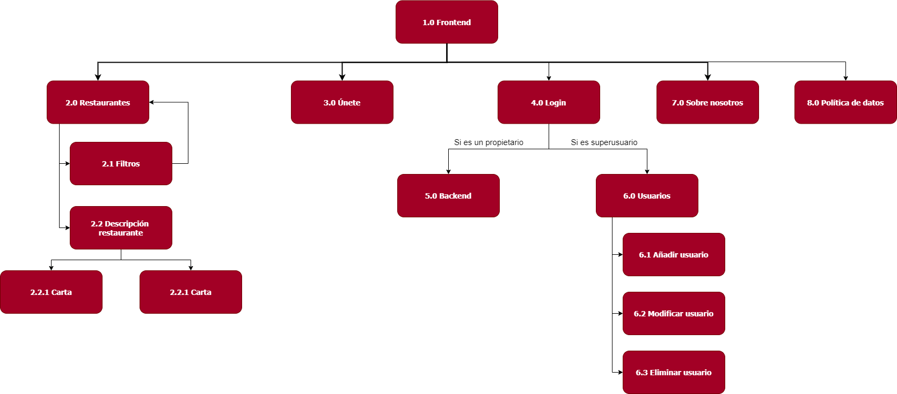

# Bienvenido a la primera versión de Servit

  

La primera versión de Servit abarca lo referido a la página web. A continuación explicamos brevemente como fue el prototipado y bocetaje de la página web.

## Matriz de tareas de usuario

A continuación se muestra la matriz de tareas de usuario de la página web. Contamos con dos posibles tipos de usuarios en la web:

*  **Propietarios.** Serán los usuarios que se registren en la web para poder gestionar su local.
* **Interesados.** Serán los usuarios que simplemente entrarán a la web para informarse o para consultar qué restaurantes están registrados en la plataforma y ver información relacionada con ellos, como puede ser su horario o ubicación.
* **Superusuario**. Tendrá la capacidad de gestionar los usuarios de la web.

Para cada tarea, especificamos con qué frecuencia se llevarán a cabo para cada usuario. La leyenda es la siguiente:

* L: baja frecuencia (Low).
* M: media frecuencia.
* H: alta frecuencia (High).
* HH: frecuencia muy alta.

### Tareas que se llevaron a cabo en esta versión

|                                | Propietarios | Interesados | Superusuario |
| ------------------------------ | :----------: | :---------: | :----------: |
| Iniciar sesión                 |      HH      |      -      |      HH      |
| Gestionar los productos        |      HH      |      -      |      -       |
| Gestionar los empleados        |      HH      |      -      |      -       |
| Gestionar los espacios         |      HH      |      -      |      -       |
| Asignar una mesa a un empleado |      HH      |      -      |      -       |
| Consultar restaurantes         |      L       |      H      |      L       |
| Gestionar las categorías       |      H       |      -      |      -       |
| Cambiar datos del restaurante  |      M       |      -      |      -       |
| Editar datos del perfil        |      L       |      -      |      -       |
| Gestionar los usuarios         |      -       |      -      |      HH      |

### Tareas para futuras versiones

|                                 | Propietarios | Interesados | Superusuario |
| ------------------------------- | :----------: | :---------: | :----------: |
| Ver informes sobre las mesas    |      HH      |      -      |      -       |
| Filtrar restaurantes            |      L       |      H      |      L       |
| Ver/filtrar jornadas de trabajo |      H       |      -      |      -       |
| Gestión de los menús            |      M       |      -      |      -       |
| Gestión de las sedes            |      L       |      -      |      -       |
| Exportación de datos a excel    |      L       |      -      |      -       |

## Sitemap

El sitemap se ha dividido en dos, el primero muestra la página sin haber iniciado sesión y el segundo una vez iniciado sesión, como si fuéramos el propietario de un restaurante. La etiqueta 5.0 “Backend” conecta los dos *sitemap*.

  

  

## Labelling

En el *labelling* se explican todas las vistas especificadas en los *sitemaps*. En algunos casos, la para acceder a una vista tenemos que pulsar sobre un icono. **¡Ojo!** Solo se muestran las *label* que se han implementado en esta versión (existen más, indicadas en la documentación).

|                 Label                  |                       Icono (opcional)                       | Descripción                                                  |
| :------------------------------------: | :----------------------------------------------------------: | ------------------------------------------------------------ |
|              1.0 Frontend              |                              -                               | Primera página que nos encontramos en la web. Veremos una especie de *landing page* |
|            2.0 Restaurantes            |                              -                               | En este apartado se podrán ver los restaurantes que están utilizando Servit y filtrarlos por si estamos buscando un tipo concreto. |
|      2.2 Descripción restaurante       |                              -                               | Información de un restaurante concreto: dirección, teléfono, la carta y horario. |
|               3.0 Únete                |                              -                               | Zona donde se podrán unir nuevos restaurantes. Se tendrá que rellenar un formulario. |
|               4.0 Login                |                              -                               | Inicio de sesión para restaurantes ya registrados.           |
|              5.0 Backend               |                              -                               | “Home” que se nos muestra una vez iniciado sesión. Se distinguen las diferentes secciones a las que puede acceder para administrar su restaurante. |
|              6. Usuarios               |                              -                               | Esta corresponde con la vista del superusuario. En ella se podrán ver los propietarios que hemos dado de alta y que son usuarios de la web. |
|           6.1 Añadir usuario           |                              -                               | Dar de alta a un propietario.                                |
|         6.2 Modificar usuario          |            | Cambiar los datos de un propietario.                         |
|          6.3 Eliminar usuario          |          | Eliminar propietario de la web.                              |
|           7.0 Sobre nosotros           |                              -                               | Se explica qué es Servit y se ofrece una forma de contacto.  |
|               9.0 Perfil               |                              -                               | Los usuarios podrán cambiar sus datos personales tales como el *username* o el nombre. |
|         9.1 Cambiar contraseña         |                              -                               | Para cambiar la contraseña. Deberemos introducir la anterior también como medida de seguridad. |
|        10.0 Editar restaurante         |                              -                               | Los usuarios pueden modificar los datos generales de su restaurante como son el horario, la dirección, la imagen que se muestra en la web, el nombre del restaurante, el tipo de restaurante que es según su comida.. |
|           11.0 Gestión Carta           |                              -                               | Para gestionar la carta del restaurante, como son sus productos, categorías y menús. Los diferentes elementos se mostrarán en tablas. |
|             11.1 Productos             |                              -                               | Gestión de los diferentes platos que se mostrarán en nuestra carta. |
|         11.1.1 Editar producto         |            | Nos dirige a una página con formularios previamente rellenos de un producto concreto que hayamos seleccionado. |
|         11.1.2 Nuevo producto          |                              -                               | Para crear un nuevo elemento. Tendremos una página con su formulario correspondiente (descripción, nombre, precio..). |
|        11.1.3 Eliminar producto        |          | Eliminar un producto concreto.                               |
| 11.1.4 Ocultar o visibilizar producto  |  | Para visibilizar u ocultar un producto de la carta. Cuando esté visible, aparecerá el ojo sin tachar y si queremos ocultarlo, lo pulsamos y nos parecerá el ojo tachado. |
|     11.1.5 Categoría seleccionada      |                              -                               | Los productos se organizan en categorías, así que tendremos que elegir la categoría de la cual queremos ver sus productos. |
|            11.2 Categorías             |                              -                               | Gestión de las categorías en las que se van a organizar los productos. |
|        11.2.1 Editar categoría         |            | Podemos modificar el nombre de la categoría.                 |
|         11.2.2 Nueva categoría         |                              -                               | Para crear una nueva categoría. Tendremos que asignarle un nombre. |
|       11.2.3 Eliminar categoría        |          | Para eliminar una categoría nos tenemos que asegurar previamente de que no tiene ningún producto asociado. |
| 11.2.4 Ocultar o visibilizar categoría |  | Para ocultar alguna sección de la carta (una categoría).     |
|         12.0 Gestión empleados         |                              -                               | Sección relacionada con los empleados de un restaurante.     |
|          12.1 Editar empleado          |            | Podemos cambiar los datos de un empleado o su rol.           |
|          12.2 Nuevo empleado           |                              -                               | Para crear un empleado tenemos que asignarle un usuario y una contraseña. |
|         12.3 Eliminar empleado         |          | Eliminar un empleado de nuestro restaurante.                 |
|      12.4 Dar de baja un empleado      |  | La diferencia con eliminar es que no se borran sus datos. Se restringe su acceso. |
|      13.0 Gestión de los espacios      |                              -                               | En esta sección podremos establecer las zonas que tiene el restaurante y las mesas correspondientes. |
|       13.1 Gestión de las zonas        |                              -                               | Establecemos las zonas en las que se distribuye nuestro restaurante (barra, terraza, salones..). |
|           13.1.1 Editar zona           |            | Podemos editar el nombre de la zona.                         |
|           13.1.2 Nueva zona            |                              -                               | Creamos una nueva zona a partir de su nombre y el número de mesas (en caso de que sea un salón o terraza) o secciones (en caso de que sea una barra). |
|          13.1.3 Eliminar zona          |          | Para poder eliminar una zona no puede tener mesas asociadas. |
| 13.1.4 Ocultar o visibilizar una zona  |  | Podemos excluir una zona (por ejemplo, si la terraza no se abre en verano podemos ocultarla). |
|       13.2 Gestión de las mesas        |                              -                               | Para una zona concreta, detallamos sus mesas (o secciones si es una barra). |
|           13.2.1 Editar mesa           |            | Podemos cambiar aspectos de la mesa como por ejemplo el empleado que la atiende, si está reservada o el número de comensales. |
|           13.2.2 Nueva mesa            |                              -                               | Cada mesa tiene un número asociado.                          |
|          13.2.3 Eliminar mesa          |          | Eliminar una mesa de nuestro registro.                       |
| 13.2.4 Ocultar o visibilizar una mesa  |  | Por si queremos ocultar alguna mesa de la sección de mesas de nuestros empleados para que no sea atendida. |
|        13.2.5 Zona seleccionada        |                              -                               | Las mesas se organizan por zonas, así que tendremos que elegir la zona de la cual queremos ver sus mesas. |

## Bocetos

A continuación, mostramos algunos de los bocetos que se llevaron a cabo en el diseño de la web (solo enseñamos los más relevantes, en la documentación se encuentran todos).

#### Menú principal

  

#### Gestión de productos

  

#### Empleados

  

#### Informes

  

#### Gestión de espacios

  

#### Ejemplo de formulario (producto)

  

