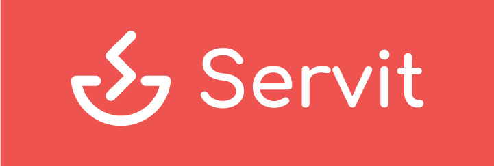

# Bienvenido a la segunda versión de Servit

  

La segunda versión de Servit abarca lo referido a la aplicación móvil. A continuación explicamos brevemente como fue el prototipado y bocetaje de la aplicación.

## Matriz de tareas de usuario

En la aplicación contamos con tres posibles tipos de usuarios: 

* **Clientes.** Utilizarán la aplicación como herramienta para realizar sus pedidos en los restaurantes y dejar su opinión sobre el servicio.
* **Camareros.** Utilizarán la aplicación como herramienta de trabajo para atender a los clientes, principalmente para saber qué productos tienen que llevar a qué mesa.
* **Cocineros**. La aplicación les proporcionará una interfaz que les mostrará los productos que tienen que preparar y ellos podrán indicar qué productos están ya preparados para ser entregados al cliente.

Para cada tarea, especificamos con qué frecuencia se llevarán a cabo para cada usuario. La leyenda es la siguiente:

* L: baja frecuencia (Low).
* M: media frecuencia.
* H: alta frecuencia (High).
* HH: frecuencia muy alta.

### Tareas que se llevaron a cabo en esta versión

|                        | Cliente | Camarero | Cocinero |
| ---------------------- | :-----: | :------: | :------: |
| Navegar por la carta   |   HH    |    -     |    -     |
| Gestión del pedido     |   HH    |    -     |    -     |
| Ver comandas           |    -    |    HH    |    -     |
| Asociarse con mesa     |    H    |    -     |    -     |
| Valorar la experiencia |    H    |    -     |    -     |
| Iniciar sesión         |    L    |    L     |    L     |
| Ver restaurantes       |    M    |    -     |    -     |
| Pedir la cuenta        |    M    |    -     |    -     |
| Registrarse            |    L    |    -     |    -     |
| Dar propina            |    L    |    -     |    -     |

Nota: la asociación con la mesa en esta versión no se hace con código QR. Queda pendiente para la versión 3.

### Tareas para futuras versiones (fase 3)

|                                         | Cliente | Camarero | Cocinero |
| --------------------------------------- | :-----: | :------: | :------: |
| Ver comandas en cocina                  |    -    |    -     |    HH    |
| Indicar producto como preparado         |    -    |    -     |    HH    |
| Generación e impresión del ticket       |    -    |    HH    |    -     |
| Dividir la cuenta entre comensales      |    -    |    H     |    -     |
| Añadir anotación aclaratoria del pedido |    M    |    -     |    -     |
| Filtrar la carta por alérgenos          |    M    |    -     |    -     |
| Reservar mesa                           |    M    |    -     |    -     |
| Llamar al camarero                      |    M    |    -     |    -     |
| Pagar                                   |    M    |    -     |    -     |
| Filtrar restaurantes                    |    L    |    -     |    -     |
| Poner una queja                         |    L    |    -     |    -     |

## Sitemap

  

## Labelling

En el *labelling* se explican todas las vistas especificadas en los *sitemaps*. En algunos casos, la para acceder a una vista tenemos que pulsar sobre un icono. **¡Ojo!** Solo se muestran las *label* que se han implementado en esta versión (existen más, indicadas en la documentación).

|               Label                |                    Icono (opcional)                    | Descripción                                                  |
| :--------------------------------: | :----------------------------------------------------: | ------------------------------------------------------------ |
|             1.0 Login              |                           -                            | Inicio de sesión o registro en su defecto. Sin iniciar sesión no podremos acceder a la funcionalidad de la aplicación. |
|        2.0 Listado de mesas        |                           -                            | El camarero puede ver la lista de mesas que tiene asignadas. |
|            2.1 Comandas            |     | Se muestran los productos pendientes de entregar en una mesa. |
|   2.1.1 Notificar como entregado   |   | El producto deja de aparecer en comandas pues ya lo hemos entregado. |
|    2.2 Productos ya entregados     |  | Lista de productos que ya se han servido.                    |
|          3.0 Restaurantes          |                           -                            | Similar a la parte pública de la web. Es lo primero que se muestra si hemos iniciado sesión. |
|          3.1 Restaurante           |                           -                            | Información de un restaurante concreto.                      |
|          3.1.2 Ver carta           |                           -                            | Es interesante poder ver la carta de los restaurantes para decidir a cuál ir. |
|            3.3.1 Carta             |                           -                            | Se muestra la carta (categorías, productos y menús del restaurante). |
|         3.3.1.1 Categorías         |                           -                            | Vemos las categorías de la carta.                            |
|        3.3.1.1.1 Productos         |                           -                            | Vemos los productos de la carta. Podemos añadirlos a nuestro pedido. |
|            3.3.2 Pedido            |                           -                            | Un resumen de lo que llevamos en el pedido actual. Podemos modificarlo. |
|            3.3.3 Cuenta            |                           -                            | Un resumen de la cuenta total (todo lo que hayamos pedido). Permite pedir la cuenta e incluso dar una propina. |
|        3.3.3.1.1Valoración         |                           -                            | El usuario responde unas preguntas cortas sobre su estancia en el restaurante. |
|             4.0 Perfil             |                           -                            | Para que el usuario pueda modificar sus datos.               |
|          5.0 Valoraciones          |                           -                            | En esta sección se muestran tanto las valoraciones completadas (por si queremos modificarlas) como las que faltan por hacer. |
| 5.1 Modificar/completar valoración |                           -                            | Accedemos a una valoración concreta para modificarla o hacerla. |

## Bocetos

A continuación, mostramos algunos de los bocetos que se llevaron a cabo en el diseño de la app (solo enseñamos los más relevantes, en la documentación se encuentran todos). Para ver capturas del resultado final, pincha en el siguiente [link](../capturas resultado final/)

### Parte cliente

|  |  |       |
| :----------------------------------------------------------: | :----------------------------------------------------------: | :--------------------------------------------------------: |
|        |        |  |

### Parte camarero

  

